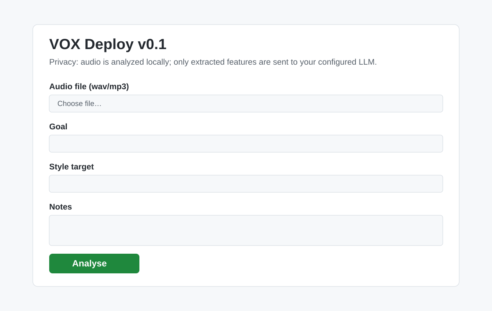

# VOX Deploy v0.1

VOX Deploy is a clone-and-run local app for vocal coaching analysis. You upload an audio file, the app extracts measurable features locally, and sends only those features plus your goal/style/notes to an OpenAI-compatible LLM endpoint.

## Privacy

- Audio feature extraction happens locally on your machine.
- Raw audio is **not** sent to the LLM.
- Only extracted numeric features + your text inputs are transmitted.

## Preview



## What it does

1. Accepts `.wav` / `.mp3` uploads through a minimal web UI.
2. Measures deterministic audio features (duration, RMS stats, dynamic range, pyin F0 stats).
3. Prompts an OpenAI-compatible `/chat/completions` endpoint.
4. Requires strict JSON output.
5. Validates the output against `schemas/vox_report.schema.json`.
6. Shows validated pretty JSON or detailed validation/debug errors.

## Prerequisites

- Python 3.12+
- OR Docker

## Quickstart (Python venv)

```bash
git clone <your-repo-url> vox-deploy
cd vox-deploy
python3 -m venv .venv
source .venv/bin/activate
pip install -r requirements.txt
cp .env.example .env
# edit .env and set LLM_API_KEY (optionally LLM_BASE_URL, LLM_MODEL)
uvicorn app.main:app --reload
```

Open: http://127.0.0.1:8000

## Quickstart (Docker)

```bash
git clone <your-repo-url> vox-deploy
cd vox-deploy
cp .env.example .env
# edit .env and set LLM_API_KEY

docker build -t vox-deploy .
docker run --rm --env-file .env -p 8000:8000 vox-deploy
```

Open: http://127.0.0.1:8000

## Environment variables

In `.env`:

```env
LLM_BASE_URL=https://api.openai.com/v1
LLM_MODEL=gpt-4o-mini
LLM_API_KEY=PASTE_YOUR_KEY_HERE
```

## Supported providers

Any provider with an OpenAI-compatible `POST /chat/completions` API can be used by changing:

- `LLM_BASE_URL`
- `LLM_MODEL`
- `LLM_API_KEY`

## Troubleshooting

- **400 `LLM_API_KEY is missing`**
  - Copy `.env.example` to `.env` and set a valid `LLM_API_KEY`.
- **Audio parse/feature extraction errors**
  - Ensure your file is valid WAV/MP3 and at least ~1 second long.
- **422 invalid JSON / schema failure**
  - The app returns both a structured error and the LLM raw output for debugging.
  - Try a model/provider that reliably returns strict JSON.
- **Windows dependency issues (`librosa`/`soundfile`)**
  - Prefer the Docker workflow to avoid local build issues.

## API behavior summary

- `GET /` serves the web UI.
- `POST /analyse` accepts `multipart/form-data`:
  - `audio` (required file)
  - `goal` (optional)
  - `style_target` (optional)
  - `notes` (optional)

Returns:
- `200` with pretty JSON report string when schema-valid.
- `400` for missing API key/audio issues.
- `422` for non-JSON output or schema mismatch (with raw output).
- `502` when LLM HTTP call fails.

## Ramblbox (v0 stub)

An experimental capture loop built on the same audio → LLM → strict-JSON pipeline. Instead of
transcribing one meeting, it captures a **session** made of many short segments (record → stop →
think → record again) and assimilates the whole thing into one structured note only when you press
**Done**. You can add more segments and re-assimilate until you **archive** the session, which seals
it. See `docs/ramblbox-mvp-plan.md` for the rationale.

- Web UI: `GET /ramblbox` (one-tap `MediaRecorder` record button; no always-on/background capture).
- API:
  - `POST /session` — create a session (`201`, status `active`).
  - `POST /session/{id}/segment` — upload one audio segment; transcribed on arrival (`201`).
  - `DELETE /session/{id}/segment/{segment_id}` — drop a segment before assimilation.
  - `POST /session/{id}/assimilate` — stitch all segments and produce a `ramble_note`; re-runnable,
    each run bumps `version`. `409` once archived.
  - `POST /session/{id}/archive` — seal the session (no more segments or assimilation).
  - `GET /session/{id}` — current segments, status, and latest note.
- Transcription is stubbed by default (`TRANSCRIBE_STUB=true`) so the loop runs with no ASR key; set
  it `false` to transcribe via `{LLM_BASE_URL}/audio/transcriptions`.
- Sessions persist in SQLite at `RAMBLBOX_DB_PATH` (default `ramblbox.db`).

## License

MIT
