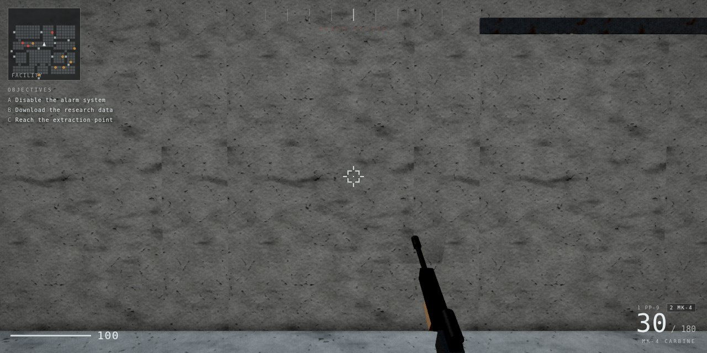

# Greyline

An objective-based first-person shooter that runs in a browser, in the mould
of the N64-era mission shooters: a briefing, an objective list that grows
with the difficulty you pick, guards who raise alarms, key cards, gadgets and
an end-of-mission debrief. Built on [three.js](https://threejs.org) with
sunlight, shadows, image-based lighting, ambient occlusion and a filmic post
chain.

Every polygon, texture and sound in it is generated by code at load time.
There are no models, no image files and no audio files in this folder.



## Play it

```bash
# any static server works; the page loads dist/greyline.js
cd games/greyline
python3 -m http.server 8080     # then open http://127.0.0.1:8080
```

Best on a desktop with a mouse. On a phone, turn the device sideways.

| Action | Keyboard / mouse | Touch |
| --- | --- | --- |
| Move | `WASD` | left half of the screen |
| Look | mouse | right half of the screen |
| Fire | left button | FIRE |
| Aim | right button | AIM |
| Sprint / crouch / jump | `SHIFT` / `CTRL` / `SPACE` | push the stick far forward / CROUCH / JUMP |
| Use — consoles, panels, pickups | `F` (hold) | USE |
| Switch weapon | `1`–`5`, `Q`, wheel | SWAP |
| Detonate charges | `G` | DET |
| Reload | `R` | RELOAD |
| Pause | `ESC` | — |

## The mission

You start on the street outside the compound with a silenced pistol. Inside
is a floorplan of rooms and corridors with guards patrolling it.

| Difficulty | Objectives | Guards |
| --- | --- | --- |
| Agent | disable the alarm system, download the research data, extract | 11 |
| Secret Agent | + destroy the server bank | 15 |
| 00 Agent | + recover the commander's intel, 8-minute limit | 19 + commander |

The extraction pad is behind a locked door; the key card is somewhere inside.
Guards who see you spend a couple of seconds on the radio before the alarm
goes up, and once it does, reinforcements keep arriving — so the alarm room
is worth reaching early, and the silenced pistol is worth keeping. Every shot
makes a noise with a radius: 7m for the silenced pistol, 45m for a carbine.
Guards inside that radius come looking.

Hits resolve against head, torso and limbs separately (2.7x / 1.0x / 0.55x),
each with its own stagger, and guards drop what they were carrying.

## What is actually being rendered

**Lighting.** A Preetham sky shell provides the visible sky; a directional
sun with a 2k shadow map that follows the player provides the key light. The
environment map for reflections is a separate hand-built equirect rather
than the sky itself — the sky's sun disc carries HDR values large enough to
overflow the PMREM blur to NaN, which renders every PBR surface black.

**Post.** Ground-truth ambient occlusion, then bloom on the linear HDR
buffer, then tone mapping and colour conversion, then a grade pass doing
bleach, an S-curve, vignette, grain, chromatic aberration and a cheap
camera-motion blur driven by how fast the view is turning. Order matters:
bloom has to run before tone mapping (its threshold is in scene-referred
units) and the grade after it (it works in perceptual terms).

**Surfaces.** `textures.js` generates concrete, plaster, brick, asphalt,
painted metal and sandbag cloth as 1k albedo / normal / roughness sets. Each
one builds a height field first — aggregate, mortar courses, cracks,
staining, rust — and the normal map is a Sobel of that height, so the
lighting response matches the colour map instead of being an unrelated bump.

**The compound.** `facility.js` builds the interior from a floorplan — one
character per 2.6m cell — into walls, ceilings, sliding doors, consoles,
server racks, crates, lights and patrol nodes. The same grid backs A*
pathfinding, so guards come round corners instead of grinding along the wall
between you and them, and it drives the minimap. Six point lights are
recycled between the nearest fixtures, so a building full of lamps costs the
same as six.

**The street.** `world.js` stitches the approach from parametric parts: building
masses with real window reveals, sills, lintels, balconies, shopfronts,
cornices and rooftop clutter, plus alleys, an archway, sandbag positions,
jersey barriers, wrecks, rubble, lamps and catenary cables. Everything is
merged per material into a handful of draw calls, and mirrored into a list
of AABBs that serves as both the collision world and the bullet target set —
a slab test over a flat `Float32Array`, no BVH needed.

**Combat.** Hitscan with spread that grows with recoil, sprint and being
airborne. Enemies are resolved against a body cylinder and a head sphere, so
headshots are a real thing to aim for. The soldiers hold position until they
have line of sight, then close to a fighting distance, strafe, and fire in
bursts; they check line of sight against the same AABB world.

## Performance

Quality presets trade the expensive passes first: **high** is AO + bloom at
up to 2x pixel ratio, **medium** drops AO, **low** drops bloom too and pins
the pixel ratio to 1. Touch devices start at medium. The game also samples
its own frame rate and steps the preset down (never up) if it cannot hold
40fps, so a weak GPU degrades instead of crawling. Picking a preset by hand
turns the auto-tuner off.

## Honest limits

This is a hand-built renderer and a hand-built level, not a shipped AAA
game. It has no photoscanned materials, no rigged characters or mocap, no
audio recordings, no level streaming and no networking. The mission is one
compound with one floorplan, not a campaign. What it does have is a coherent
3D world with a real mission structure in it, generated entirely from code.

## Source layout

| File | Contents |
| --- | --- |
| `src/engine.js` | renderer, sky, IBL, shadows, post chain, quality presets |
| `src/textures.js` | procedural PBR surface generation |
| `src/world.js` | level generation, merging, collision and raycasts |
| `src/player.js` | first-person controller and movement feel |
| `src/weapon.js` | viewmodel, recoil springs, firing, tracers, shells |
| `src/facility.js` | floorplan compound, doors, props, A* navigation |
| `src/mission.js` | objectives, difficulty, alarms, gadgets, debrief |
| `src/weapons.js` | weapon table and the player's loadout |
| `src/enemies.js` | guard model, patrol/alert/search AI, hit zones |
| `src/hud.js` | HUD and minimap |
| `src/audio.js` | synthesized weapon and impact audio |
| `src/main.js` | game loop, input, flow, auto-tuning |

## Build

`dist/greyline.js` is committed so the page runs without a build step.
To rebuild after editing `src/`:

```bash
npm install
npm run build      # or: npm run dev  (watch)
```
