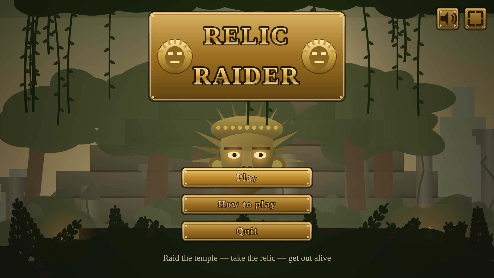
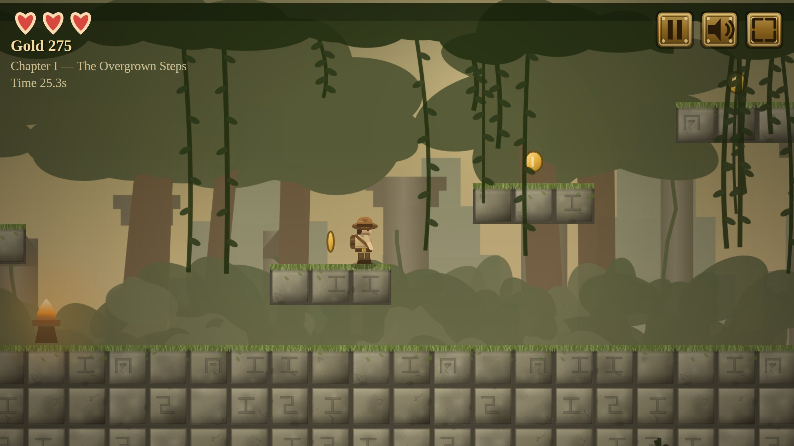

# Relic Raider

A side-scrolling temple raid that runs in any modern browser. Raid the ruins,
lift the golden relic from its pedestal, and sprint back to the door before the
temple comes down on top of you.




## Play it

Open `index.html` — that's it. No build step, no dependencies, no network
access, and no asset files: every sprite, tile, backdrop and sound effect is
generated procedurally at load time, at whatever resolution your screen needs
(see [Resolution](#resolution) below).

Some browsers restrict `file://` pages; if anything misbehaves, serve the
folder instead:

```bash
cd games/relic-raider
python3 -m http.server 8080     # then open http://127.0.0.1:8080
```

## Controls

| Action | Keyboard | Touch |
| --- | --- | --- |
| Move | `←` `→` or `A` `D` | left thumb pad |
| Jump | `Space`, `W` or `↑` | JUMP button |
| Climb vines | `↑` `↓` | pad up/down |
| Pause | `Esc` | pause icon |
| Restart chapter | `R` | pause menu |
| Mute | `M` | speaker icon |
| Fullscreen | `F` | fullscreen icon |

Jumping is forgiving on purpose: there is coyote time after walking off a
ledge, the jump input is buffered just before landing, and releasing the button
early cuts the jump short.

## How a raid works

1. Work your way right through the temple, collecting gold and gems and
   lighting checkpoint torches — a lit torch is where you respawn.
2. Lift the relic from its pedestal in the inner sanctum. The temple starts to
   collapse, the door back at the entrance unseals, and rubble begins to fall.
3. Run left. A wall of collapsing stone chases you and speeds up as it comes.
   Reach the door to bank the chapter.

You have three hearts per chapter. Spikes, darts, guardians, bats and falling
rocks cost one; a pit or the collapse wall costs one and sends you back to your
last torch. Lose them all and the ruins keep you.

**Scoring:** gold 25, gem 100, relic 750, plus 150 per heart still full and 10
per second under the chapter's par time. The best expedition total is kept in
`localStorage`.

## The chapters

| # | Chapter | Twist |
| --- | --- | --- |
| I | The Overgrown Steps | broken stairs, a dart pillar, spike beds |
| II | Halls of the Sun King | crumbling shelves over open air, bats |
| III | The Sunken Sanctum | vine climbs, a sliding slab over a chasm |

## Source layout

| File | Contents |
| --- | --- |
| `js/audio.js` | WebAudio synthesis — every sound effect plus the ambient drum/flute loop |
| `js/input.js` | keyboard, mouse and multi-touch pointer state |
| `js/art.js` | procedural tiles, parallax backdrops, sprites and the gold UI plates |
| `js/levels.js` | tile chunks, level composition and the per-chapter palettes |
| `js/game.js` | physics, entities, collisions, the collapse and world rendering |
| `js/ui.js` | title screen, menus, HUD and the on-screen thumb controls |
| `js/main.js` | canvas sizing, the viewport band and the frame loop |

Scripts are plain `<script>` tags in load order (no modules), which is what
lets the game run straight off the filesystem.

### Adding a level

Levels are stitched together from 16x16 character chunks in `js/levels.js`.
Add a chunk to `CHUNKS`, keeping solid ground on the outer columns so it
connects to its neighbours, then list it in a level's `chunks` array. The tile
legend is at the top of that file. Every level needs a `start` chunk (it holds
the spawn `P` and the door `D`) and a chunk containing the relic `R`.

### Resolution

Nothing is pre-rendered, so there is no fixed art resolution to outgrow.
Characters, pickups and the UI are drawn as vector paths every frame, and the
baked bitmaps — tiles and parallax backdrops — are re-rendered whenever the
zoom or the device pixel ratio changes, at one bitmap pixel per device pixel
(`Game.detail`, up to 6x, capped at 2.5x for the large backdrop layers).
On a 3x phone panel that means 192px tiles rather than 32px ones, so cracks,
moss blades and carved glyphs stay sharp instead of being upscaled. Re-baking
a full set costs about 30ms, and only happens on level start or a resize that
crosses a detail step.

Every baked bitmap also keeps a copy at its exact on-screen device size, so
the per-frame draw is a 1:1 blit rather than a filtered rescale — the single
biggest win in the renderer. The sky and the vignette are cached the same way
instead of being re-gradiented each frame. The device pixel ratio is kept a
whole number for the same reason: at a fractional ratio, integer CSS
coordinates land between device pixels and every blit falls back to filtering.

If the frame rate still can't hold up, the game notices: it samples frame
times and steps the render scale down (3x -> 2x -> 1x, never back up) so a
weaker device stays smooth instead of crawling at full resolution.

On iPhone, the HUD, the corner buttons and the thumb pad are kept inside the
safe area, and the fullscreen button hides itself where the browser doesn't
allow element fullscreen (iPhone Safari, or an embedded frame).

### Layout on tall screens

The world is drawn into a horizontal band sized to the level's height. On a
portrait phone the band sits in the middle of the screen, the sky and
undergrowth bleed past its edges so the seam is invisible, and the spare room
below it holds the thumb controls.
